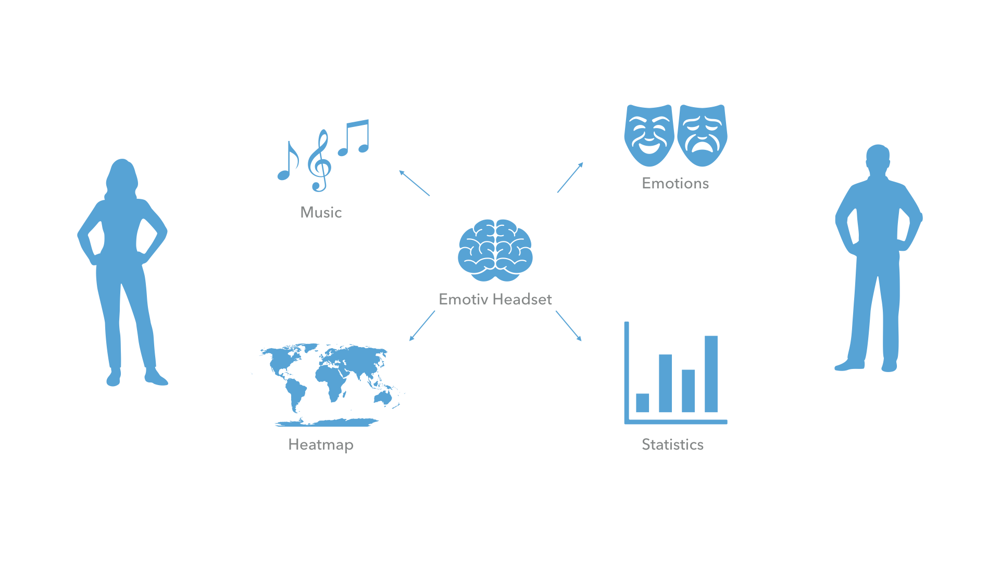
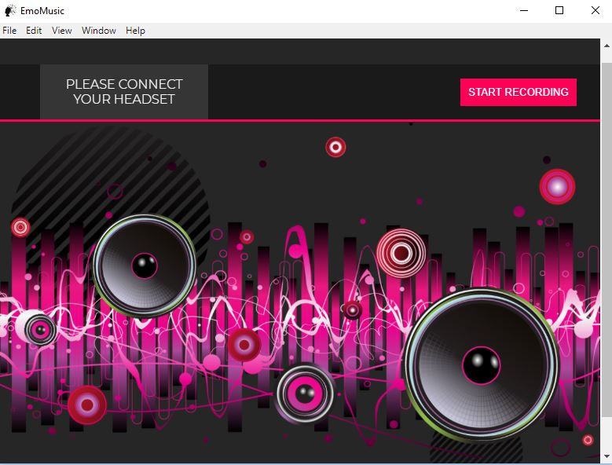
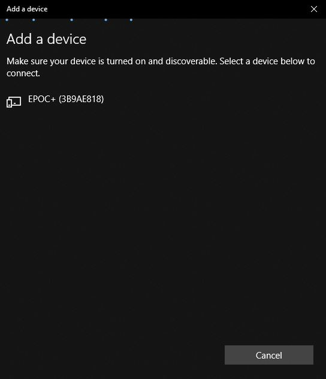
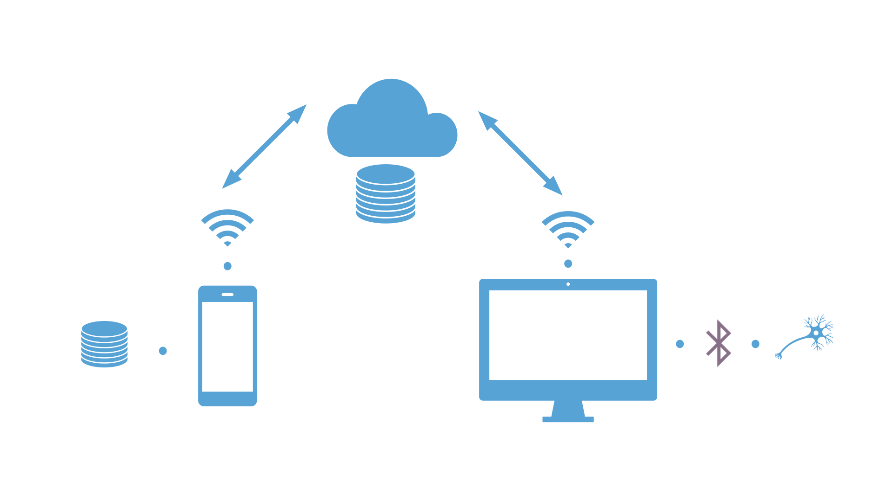

# EmoMusic 
*Developed by: Duoaa Khalifa & Nadya Abdel Madjid*

# Description

EmoMusic: Emotions + Music

An interactive mobile application along with a desktop application and an EEG headset (Emotiv). The mobile application allows the user to view his/her emotion levels at the moment, display statistics of each emotion for the past one month, explore the personalized happiness heatmap based on the user's all-time recorded data or common happiness heatmap based on all user's data. Finally, play music tracks and notice the change in the emotions' levels.

# Installation and Setup
## Desktop Application and Emotiv Headset

1. Clone the repository.
2. Unzip the file **emotiv** and go to the release-builds directory. 
3. Run the proper file According to your operating system.
4. After a successful installation, the application will launch automatically. (see figure below)

5. Switch on your Emotiv headset.

  
   

6. Via Bluetooth, connect the headset manually to your computer.

7. Go back to the desktop application. It should display he  message "Your headset is connected".

8. Put on the headset and click on **Start Recording**.

## Mobile Application
 1. Sign-up and login to the mobile application. The Id is your Emotiv headset unique id.
 
 
 
 2. The main page consists of 8 buttons. The forth till the eighth button each corresponds to one of the six emotions: Interest, Stress, Relaxation, Excitement, Engagement and Focus. Each button displays the current level of the intended emotion in percentages.
 
  
  
 3. The **Map** button directs the user to the **Happinesses Map** by default set to **My Map** which visualizes the level of happiness in the places the user visited while wearing the headset.The user have the option to Choose between two radii, gradients and opacities The Happiness level is calculated based on the following formula:
  
    Happiness Level = (15% * Interest Level) + (15% * Engagement Level) + (35% Interest Level) + (35% 		Relaxation Level) 

 

4. From the Drop-down list, the user can choose **Common Map** which is the **Happiness Map** but based on all users level of happiness (In places the all users visited while wearing the headset).

5. Back to the main menu, the **Play** button directs the user to a playlist of the songs retrieved from the user's mobile phone. The user can play a song then go back to the main menu and observe the change in the emotion levels based on the music track s/he is playing. The user can play, pause, fast-forward, rewind, skip to the next song, back to the previous song and user can leave the application whilst the music track is still playing (A notification will show the current playing song, by tapping on it, the user will be redirected to the application). If the user wishes to stop the music track, s/he can use the ***X*** icon on the top most-right of the page.   

# Connection Map (Distributed systems)

The headset is connected to the computer via Bluetooth, the desktop application reads data from the headset, the data is then transferred and stored in the sever. The mobile application receives the data from the server and utilize it for use in the Happiness Map and statistics. The mobile application contains a database for local storage (Display statistics even if the user is not connected to the Internet. 

# Software Architecture 
## Desktop Application

The desktop application was developed with **Electron**, fully written in **Node.js**. The headset **Emotiv SDK** was integrated within the application to be able to connect to the headset and retrieve the performance metrics data. The readings are retrieved every 10 second. To associate these readings with a geo-tag (to be used for generating the Happiness Map), the location as longitude and latitude is recorded every 10 seconds via WIFI by Integrating **Google Maps API**. The data is send to the server via a HTTP request also written in Node.js.

## Emotiv Headset

The performance metrics measures (as percentages) including: Interest, Stress, Relaxation, Excitement, Engagement and Focus are retrieved from the the headset. According to Emotiv website [1], to compute levels that define each emotion; detection algorithms are used. These algorithms were achieved by the means of conducting many scientific studies that led to the development of accurate machine learning algorithms. The exact algorithms used were not mentioned, but in a study conducted by Lin et al. [2] where they classify emotions from raw EEG (electroencephalogram) signals retrieved from Emotiv headset, the classification algorithms they used are Linear Discriminant Analysis (LDA) and Support Vector Machine (SVM). 

## Server

For the server side, **Amazon EC2** server is used. The server stores the data retrieved from the

	
	

