# EmoMusic 
*Developed by: Duoaa Khalifa & Nadya Abdel Madjid*

# Description

EmoMusic: Emotions + Music

An interactive mobile application along with a desktop application and an EEG headset (Emotiv). The mobile application allows the user to view his/her emotion levels at the moment. The user can display statistics of each emotion for the past one month, explore the personalized happiness heatmap based on the user's all-time recorded data or common happiness heatmap based on all user's data and play music tracks and notice the change in the emotions' levels.

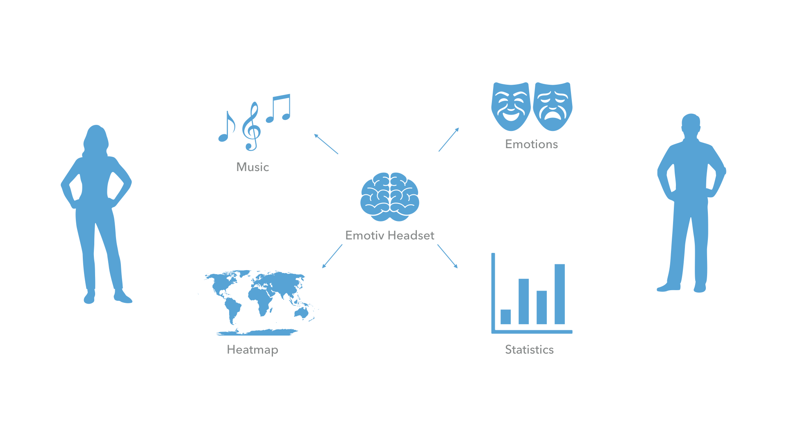

# Installation and Setup
## Desktop Application and Emotiv Headset

1. Download the application from the following link:
https://drive.google.com/drive/folders/1g6CJFuNcRF9of6hmKIIRR_YSMg2H-jt-
2. Unzip the file **emotiv** and go to the release-builds directory. 
3. Run the proper file According to your operating system.
4. After a successful installation, the application will launch automatically. (see figure below)

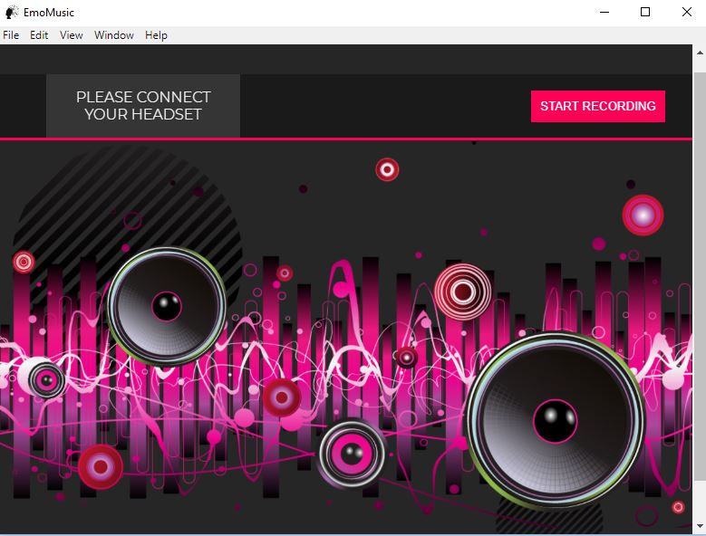

5. Switch on your Emotiv headset.

  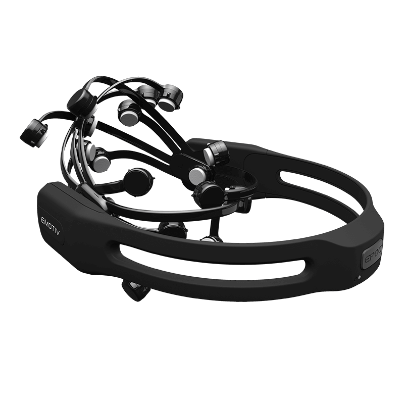
   

6. Via Bluetooth, connect the headset manually to your computer.

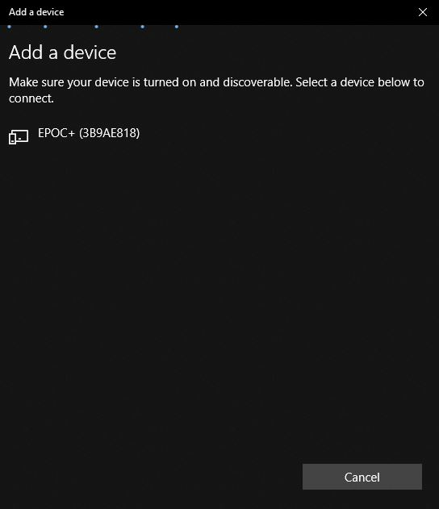

7. Go back to the desktop application. It should display the  message "Connected Headset" and the name of the headset.

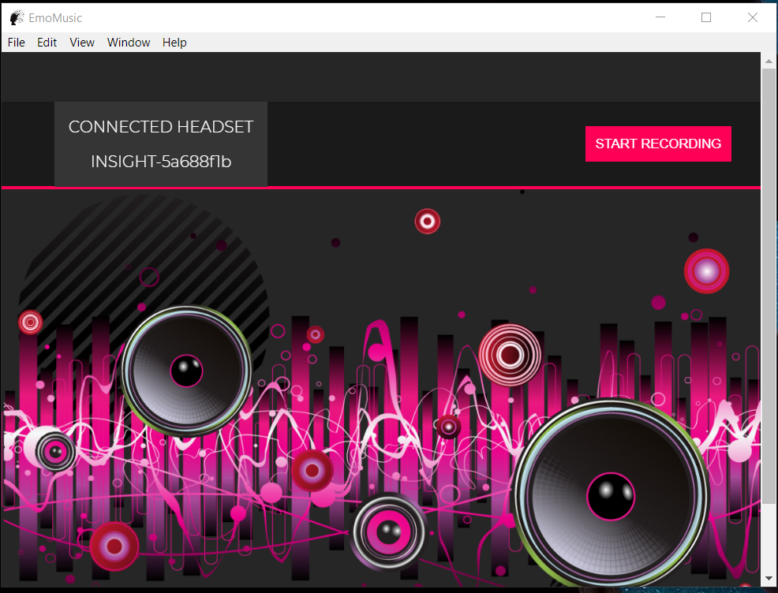

8. Put on the headset and click on **Start Recording**.

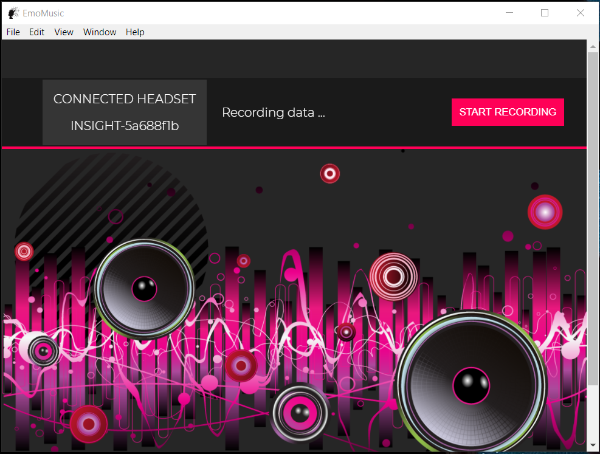

## Mobile Application

 1. Clone the repository. Go to **Mobile_Application** directory and open the project **EmoMusic_new** with Android Studio and download the application.
 
 2. Sign in to the mobile application. The Id is your Emotiv headset unique id.
 
 
 
 3. The main page consists of 8 buttons. The third till the eighth buttons each corresponds to one of the six emotions: Interest, Stress, Relaxation, Excitement, Engagement and Focus. Each button displays the current level of the intended emotion in percentages. (For emotions, the figure on the left shows no readings which means that the headset is not connected. The figure on the right displays the real time readings )
 
   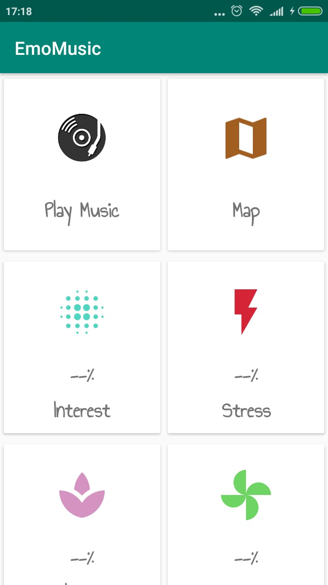
   
   
   
  

  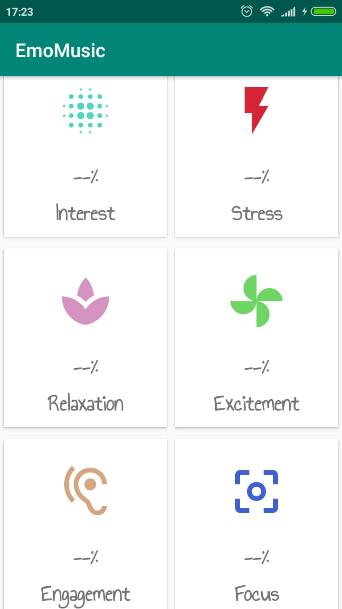
  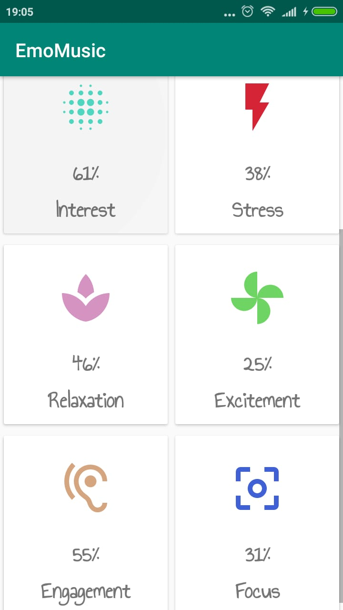 

4. Tapping on any of the emotions' buttons will direct the user to the statistics page. The page shows a one month data of the levels of the selected emotion. Looking at the figure below, the x-axis represents the day and hour (ex. 05-01:14 means day 5 of the current month at 01:14 AM) and the y-axis represents the emotion's level in percentage. The user can zoom-in for more detailed day-level reading (the minimum x-axis unit is one hour per day).

 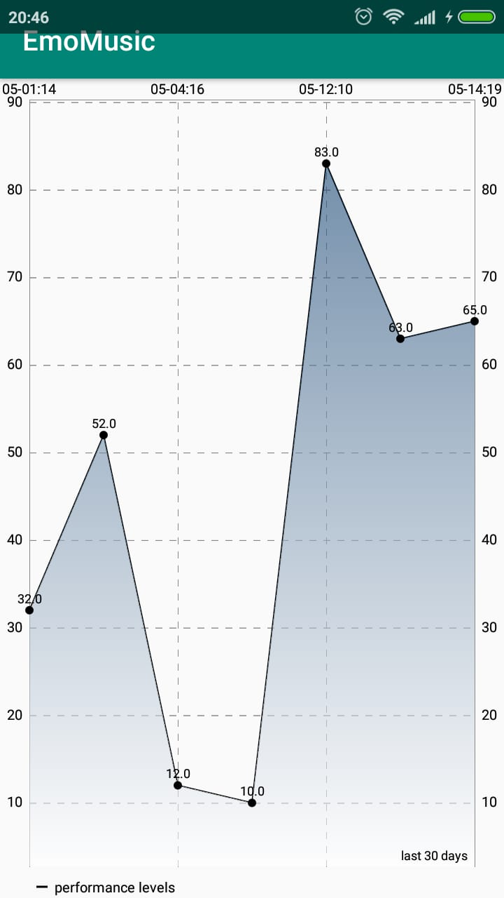
  
 5. The **Map** button directs the user to the **Happinesses Map** by default set to **My Map** which visualizes the level of happiness in the places the user visited while wearing the headset.The user has the option to choose between two radii, gradients and opacities. The Happiness level is calculated based on the following formula:
  
    Happiness Level = (15% * Interest Level) + (15% * Engagement Level) + (35% Interest Level) + (35% 		Relaxation Level) 

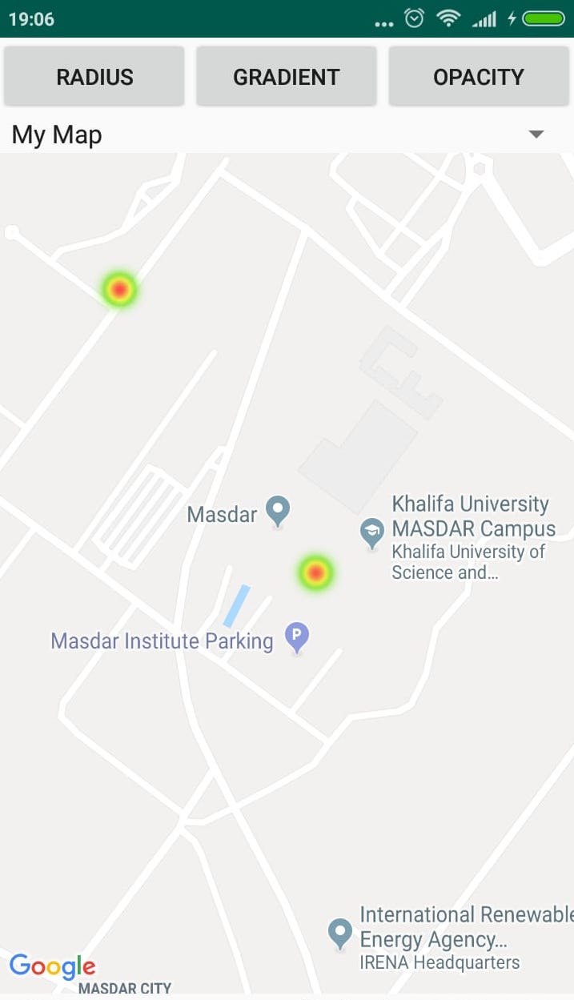 

6. From the Drop-down list, the user can choose **Common Map** which is the **Happiness Map** but based on all users level of happiness (In places the all users visited while wearing the headset). The brighter the color in the map the higher the level of happiness is.

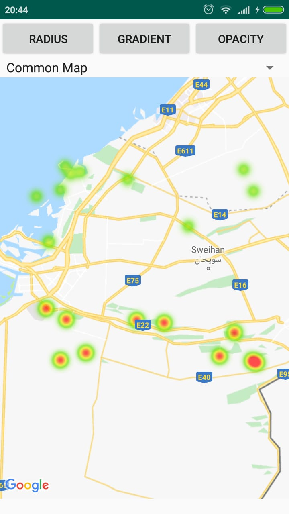 

7. Back to the main menu, the **Play** button directs the user to a playlist of the songs retrieved from the user's mobile phone. The user can play a song then go back to the main menu and observe the change in the emotion levels based on the music track s/he is playing. The user can play, pause, fast-forward, rewind, skip to the next song, back to the previous song and user can leave the application whilst the music track is still playing (A notification will show the current playing song, by tapping on it, the user will be redirected to the application). If the user wishes to stop the music track, s/he can use the ***X*** icon on the top most-right of the page.   

 

# Connection Map (Distributed systems)

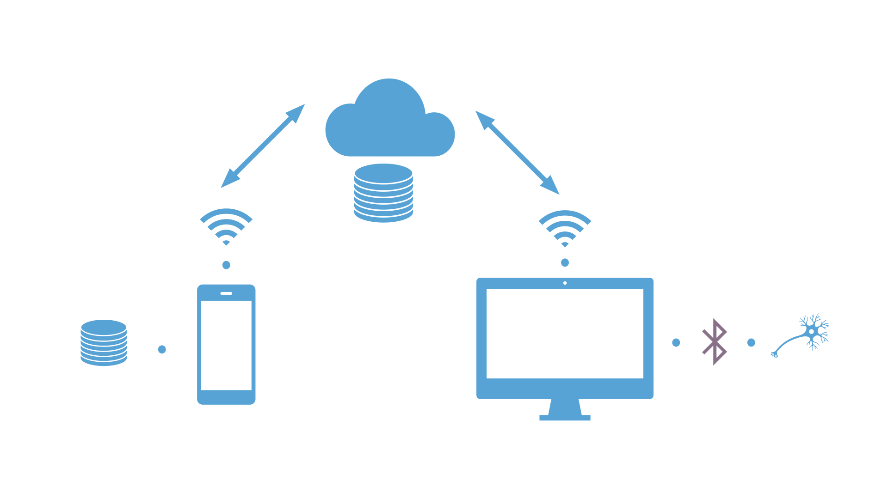

The headset is connected to the computer via Bluetooth, the desktop application reads data from the headset, the data is then transferred and stored in the sever. The mobile application receives the data from the server and utilizes it for use in the Happiness Map and statistics. The mobile application contains a database for local storage (display statistics even if the user is not connected to the Internet). 

# Software Architecture 
## Desktop Application

The desktop application was developed with **Electron**, fully written in **Node.js**. The headset **Emotiv SDK** was integrated within the application to be able to connect to the headset and retrieve the performance metrics data. The readings are retrieved every 10 second. To associate these readings with a geo-tag (to be used for generating the Happiness Map), the location as longitude and latitude is recorded every 10 seconds via WIFI through **Google Maps API** service. The data is sent to the server via a HTTP request.

## Emotiv Headset

The performance metrics measures (as percentages) including: Interest, Stress, Relaxation, Excitement, Engagement and Focus are retrieved from the the headset. According to Emotiv website [1], to compute levels that define each emotion; detection algorithms are used. These algorithms were achieved by the means of conducting many scientific studies that led to the development of accurate machine learning algorithms. The exact algorithms used were not mentioned, but in a study conducted by Lin et al. [2] where they classify emotions from raw EEG (electroencephalogram) signals retrieved from Emotiv headset, the classification algorithms they used are Linear Discriminant Analysis (LDA) and Support Vector Machine (SVM). 

## Server

For the server side, **Amazon EC2** server is used and all the scripts are written in **Node.js**. The server stores the data retrieved from the desktop application (i.e. Performance metrics and location). The calculations mentioned above regarding the Happiness Map are done here in the server, for one user (defined by the headset Id) all the data is aggregated by the first 4 digits after the decimal of both the latitude and longitude, then the Happiness level formula is applied. For the common Happiness Map, all the data regardless of the user is utilized as before. This information is sent to the mobile application upon request via HTTP. For the statistics data, before sending it to the mobile application, the data is aggregated by each hour in each day in a period of one month.

## Mobile Application

The mobile application was developed with **Android Studio**, written in **Java**. For the Happiness Map (heatmap), **Google Maps API** was integrated within Android Studio. The application sends HTTP requests to the server to receive statistics and heatmap data needed. A **SQLite Database** (Android Room) was created for the sake of local storage, in case the user is not connected to the Internet, the statistics will be plotted from the data stored in the local database.
The Music player asks for the users' permission to access the phone's storage to retrieve music tracks so the user will be able to listen to any track and notice the change in the emotions level.

# Limitations

Instead of creating a local music player and using a user's music library, we wanted to integrate a music API. Unfortunately, all APIs we found do not have a free option (plan). Spotify is a free api, but to use some of it's features, the user must have the application (Spotify) in his or her phone. And to be able to integrate an API without the need of downloading the original application this option is not available for free. We did not see this to be practical so we sticked to the local music player.

# Future Work

1. Use machine learning to classify the music tracks into categories according to the emotions.
2. According to the dominant emotion of the user, for example stress, the application will create a playlist  of songs that reduces stress (Classified using ML).
3. Emotiv Android SDK is going to be released in the future. Once released, the Emotiv headset can directly connect to the mobile application.
4. Integrate and combine features from Fitbit API with the performance metrics and power band readings from the Emotiv headset.  

# References 
1. https://www.emotiv.com/our-technology/
2. Rafael  Ramirez  and  Zacharias  Vamvakousis.   Detect-ing Emotion from EEG Signals Using the Emotive EpocDevice. volume 7670, pages 175–184, 5 2012

	
	

